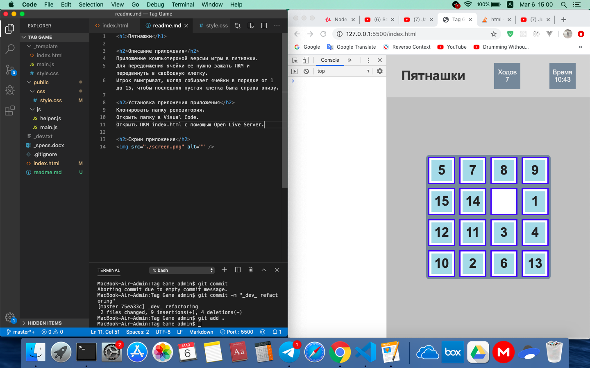

<h1>Пятнажки</h1>

<h2>Описание приложения</h2>
Приложение компьютероной версии игры в пятнажки.
Для передвижения ячейки ее нужно зажать ЛКМ и передвинуть в свободную клетку.
Игрок выигрыват, когда собирает ячейки в порядке от 1 до 15, чтобы последняя пустая клетка была справа внизу.

<h2>Установка приложения приложения</h2>
Клонировать папку репозитория.
Открыть папку в Visual Code.
Открыть ПКМ index.html с помощью Open Live Server. 

<h2>Скрин приложения</h2>
